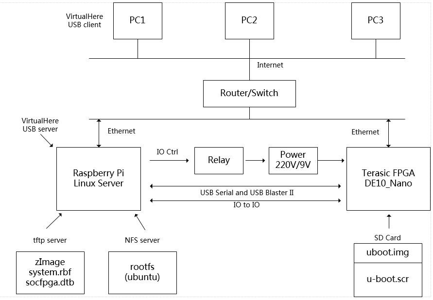
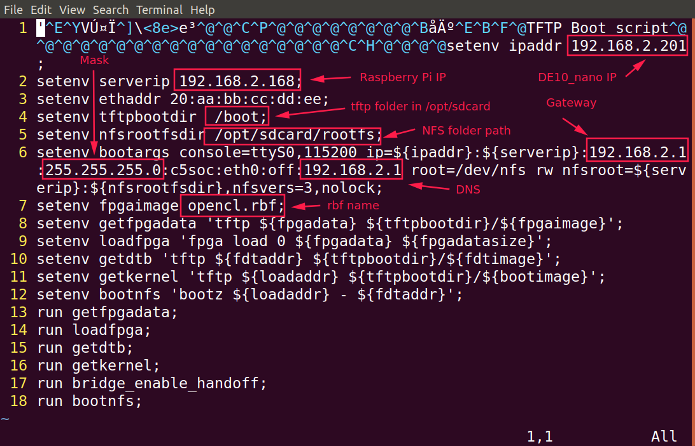

# Cyclone V SoC Online Debug System

## Hardware
- DE10-nano
- Rspberry Pi
- 2 sdcard
- router
- ...

## Network Topology


## Workflow


## How to do

1. write a rasbian image to Raspberry Pi sdcard and boot the Raspberry Pi, run
```
   sudo mkdir -p /opt/sdcard
```
then,copy the `boot` and `rootfs` to `/opt/sdcard` on Raspberry Pi sdcard

2. install tftp and nfs server on Raspberry Pi
```
   sudo apt-get install vim tftpd-hpa nfs-kernel-server
   sudo vim /etc/default/tftpd-hpa
   sudo service tftpd-hpa restart
   sudo vim /etc/exports 
   sudo service nfs-kernel-server restart
   sudo exportfs -v
   sudo minicom
   ifconfig
```
3. unzip the sdcard image anf write to a sdcard for de10_nano
4. change the ip severip gateway mask in u-boot.scr

5. boot the de10_nano

## de10_nano boot logs
```
U-Boot SPL 2013.01.01 (Dec 21 2019 - 20:22:03)
BOARD : Altera SOCFPGA Cyclone V Board
CLOCK: EOSC1 clock 25000 KHz
CLOCK: EOSC2 clock 25000 KHz
CLOCK: F2S_SDR_REF clock 0 KHz
CLOCK: F2S_PER_REF clock 0 KHz
CLOCK: MPU clock 800 MHz
CLOCK: DDR clock 400 MHz
CLOCK: UART clock 100000 KHz
CLOCK: MMC clock 50000 KHz
CLOCK: QSPI clock 3125 KHz
RESET: COLD
INFO : Watchdog enabled
SDRAM: Initializing MMR registers
SDRAM: Calibrating PHY
SEQ.C: Preparing to start memory calibration
SEQ.C: CALIBRATION PASSED
SDRAM: 1024 MiB
ALTERA DWMMC: 0


U-Boot 2013.01.01 (Dec 21 2019 - 20:23:18)
                                                                                                                                                                   
CPU   : Altera SOCFPGA Platform                                                                                                                                    
BOARD : Altera SOCFPGA Cyclone V Board                                                                                                                             
I2C:   ready                                                                                                                                                       
DRAM:  1 GiB                                                                                                                                                       
MMC:   ALTERA DWMMC: 0                                                                                                                                             
*** Warning - bad CRC, using default environment                                                                                                                   
                                                                                                                                                                   
In:    serial                                                                                                                                                      
Out:   serial                                                                                                                                                      
Err:   serial                                                                                                                                                      
Skipped ethaddr assignment due to invalid EMAC address in EEPROM                                                                                                   
Net:   mii0                                                                                                                                                        
Warning: failed to set MAC address                                                                                                                                 
                                                                                                                                                                   
Hit any key to stop autoboot:  0                                                                                                                                   
reading u-boot.scr                                                                                                                                                 
846 bytes read in 4 ms (206.1 KiB/s)                                                                                                                               
## Executing script at 02000000                                                                                                                                    
Waiting for PHY auto negotiation to complete done                                                                                                                  
ENET Speed is 100 Mbps - FULL duplex connection                                                                                                                    
Using mii0 device                                                                                                                                                  
TFTP from server 192.168.2.168; our IP address is 192.168.2.201                                                                                                    
Filename '/boot/opencl.rbf'.                                                                                                                                       
Load address: 0x2000000                                                                                                                                            
Loading: T #################################################################                                                                                       
         #################################################################                                                                                         
         ###################                                                                                                                                       
         316.4 KiB/s                                                                                                                                               
done                                                                                                                                                               
Bytes transferred = 2186584 (215d58 hex)                                                                                                                           
altera_load: Failed with error code -4                                                                                                                             
Using mii0 device                                                                                                                                                  
TFTP from server 192.168.2.168; our IP address is 192.168.2.201                                                                                                    
Filename '/boot/socfpga.dtb'.                                                                                                                                      
Load address: 0x100                                                                                                                                                
Loading: ##                                                                                                                                                        
         697.3 KiB/s                                                                                                                                               
done                                                                                                                                                               
Bytes transferred = 19284 (4b54 hex)                                                                                                                               
Using mii0 device                                                                                                                                                  
TFTP from server 192.168.2.168; our IP address is 192.168.2.201                                                                                                    
Filename '/boot/zImage'.                                                                                                                                           
Load address: 0x8000                                                                                                                                               
Loading: #################################################################                                                                                         
         #################################################################                                                                                         
         #################################################################                                                                                         
         #################################################################                                                                                         
         #################################################################                                                                                         
         ##########                                                                                                                                                
         1.2 MiB/s                                                                                                                                                 
done                                                                                                                                                               
Bytes transferred = 4914992 (4aff30 hex)                                                                                                                           
## Starting application at 0x3FF79598 ...                                                                                                                          
## Application terminated, rc = 0x0                                                                                                                                
## Flattened Device Tree blob at 00000100                                                                                                                          
   Booting using the fdt blob at 0x00000100                                                                                                                        
   reserving fdt memory region: addr=0 size=1000                                                                                                                   
   Loading Device Tree to 03ff8000, end 03fffb53 ... OK                                                                                                            
                                                                                                                                                                   
Starting kernel ...                                                                                                                                                
                                                                                                                                                                   
[    0.000000] Booting Linux on physical CPU 0x0                                                                                                                   
[    0.000000] Linux version 4.19.29 (knat@Lenovo) (gcc version 4.8.3 20131202 (prerelease) (crosstool-NG linaro-1.13.1-4.8-2013.12 - Linaro GCC 2013.11)) #12 SMP9
[    0.000000] CPU: ARMv7 Processor [413fc090] revision 0 (ARMv7), cr=10c5387d                                                                                     
[    0.000000] CPU: PIPT / VIPT nonaliasing data cache, VIPT aliasing instruction cache                                                                            
[    0.000000] OF: fdt: Machine model: Terasic DE10_NANO)                                                                                                          
[    0.000000] Memory policy: Data cache writealloc                                                                                                                
[    0.000000] cma: Reserved 512 MiB at 0x20000000                                                                                                                 
[    0.000000] random: get_random_bytes called from start_kernel+0x98/0x47c with crng_init=0                                                                       
[    0.000000] percpu: Embedded 16 pages/cpu @(ptrval) s36544 r8192 d20800 u65536                                                                                  
[    0.000000] Built 1 zonelists, mobility grouping on.  Total pages: 260096                                                                                       
[    0.000000] Kernel command line: console=ttyS0,115200 ip=192.168.2.201:192.168.2.168:192.168.2.1:255.255.255.0:c5soc:eth0:off:192.168.2.1 root=/dev/nfs rw nfsrk
[    0.000000] Dentry cache hash table entries: 131072 (order: 7, 524288 bytes)                                                                                    
[    0.000000] Inode-cache hash table entries: 65536 (order: 6, 262144 bytes)                                                                                      
[    0.000000] Memory: 502132K/1048576K available (7168K kernel code, 519K rwdata, 1628K rodata, 1024K init, 125K bss, 22156K reserved, 524288K cma-reserved)      
[    0.000000] Virtual kernel memory layout:                                                                                                                       
[    0.000000]     vector  : 0xffff0000 - 0xffff1000   (   4 kB)                                                                                                   
[    0.000000]     fixmap  : 0xffc00000 - 0xfff00000   (3072 kB)                                                                                                   
[    0.000000]     vmalloc : 0xf0800000 - 0xff800000   ( 240 MB)                                                                                                   
[    0.000000]     lowmem  : 0xb0000000 - 0xf0000000   (1024 MB)                                                                                                   
[    0.000000]     modules : 0xaf000000 - 0xb0000000   (  16 MB)                                                                                                   
[    0.000000]       .text : 0x(ptrval) - 0x(ptrval)   (8160 kB)                                                                                                   
[    0.000000]       .init : 0x(ptrval) - 0x(ptrval)   (1024 kB)                                                                                                   
[    0.000000]       .data : 0x(ptrval) - 0x(ptrval)   ( 520 kB)                                                                                                   
[    0.000000]        .bss : 0x(ptrval) - 0x(ptrval)   ( 126 kB)                                                                                                   
[    0.000000] SLUB: HWalign=64, Order=0-3, MinObjects=0, CPUs=2, Nodes=1                                                                                          
[    0.000000] ftrace: allocating 26771 entries in 79 pages                                                                                                        
[    0.000000] rcu: Hierarchical RCU implementation.                                                                                                               
[    0.000000] rcu:     RCU event tracing is enabled.                                                                                                              
[    0.000000] NR_IRQS: 16, nr_irqs: 16, preallocated irqs: 16                                                                                                     
[    0.000000] L2C: DT/platform modifies aux control register: 0x02060000 -> 0x02460000                                                                            
[    0.000000] L2C-310 enabling early BRESP for Cortex-A9                                                                                                          
[    0.000000] L2C-310 full line of zeros enabled for Cortex-A9                                                                                                    
[    0.000000] L2C-310 ID prefetch enabled, offset 8 lines                                                                                                         
[    0.000000] L2C-310 dynamic clock gating enabled, standby mode enabled                                                                                          
[    0.000000] L2C-310 cache controller enabled, 8 ways, 512 kB                                                                                                    
[    0.000000] L2C-310: CACHE_ID 0x410030c9, AUX_CTRL 0x76460001                                                                                                   
[    0.000000] clocksource: timer1: mask: 0xffffffff max_cycles: 0xffffffff, max_idle_ns: 19112604467 ns                                                           
[    0.000006] sched_clock: 32 bits at 100MHz, resolution 10ns, wraps every 21474836475ns                                                                          
[    0.000018] Switching to timer-based delay loop, resolution 10ns                                                                                                
[    0.000194] Console: colour dummy device 80x30                                                                                                                  
[    0.000226] Calibrating delay loop (skipped), value calculated using timer frequency.. 200.00 BogoMIPS (lpj=1000000)                                            
[    0.000242] pid_max: default: 32768 minimum: 301                                                                                                                
[    0.000376] Mount-cache hash table entries: 2048 (order: 1, 8192 bytes)                                                                                         
[    0.000389] Mountpoint-cache hash table entries: 2048 (order: 1, 8192 bytes)                                                                                    
[    0.000900] CPU: Testing write buffer coherency: ok                                                                                                             
[    0.000932] CPU0: Spectre v2: using BPIALL workaround                                                                                                           
[    0.001153] CPU0: thread -1, cpu 0, socket 0, mpidr 80000000                                                                                                    
[    0.001717] Setting up static identity map for 0x100000 - 0x100060                                                                                              
[    0.001846] rcu: Hierarchical SRCU implementation.                                                                                                              
[    0.002375] smp: Bringing up secondary CPUs ...                                                                                                                 
[    0.003086] CPU1: thread -1, cpu 1, socket 0, mpidr 80000001                                                                                                    
[    0.003093] CPU1: Spectre v2: using BPIALL workaround                                                                                                           
[    0.003209] smp: Brought up 1 node, 2 CPUs                                                                                                                      
[    0.003222] SMP: Total of 2 processors activated (400.00 BogoMIPS).                                                                                             
[    0.003229] CPU: All CPU(s) started in SVC mode.                                                                                                                
[    0.004189] devtmpfs: initialized                                                                                                                               
[    0.008328] VFP support v0.3: implementor 41 architecture 3 part 30 variant 9 rev 4                                                                             
[    0.008537] clocksource: jiffies: mask: 0xffffffff max_cycles: 0xffffffff, max_idle_ns: 19112604462750000 ns                                                    
[    0.008557] futex hash table entries: 512 (order: 3, 32768 bytes)                                                                                               
[    0.028629] NET: Registered protocol family 16                                                                                                                  
[    0.030500] DMA: preallocated 256 KiB pool for atomic coherent allocations                                                                                      
[    0.031699] hw-breakpoint: found 5 (+1 reserved) breakpoint and 1 watchpoint registers.                                                                         
[    0.031713] hw-breakpoint: maximum watchpoint size is 4 bytes.                                                                                                  
[    0.052851] vgaarb: loaded                                                                                                                                      
[    0.053196] SCSI subsystem initialized                                                                                                                          
[    0.053456] usbcore: registered new interface driver usbfs                                                                                                      
[    0.053513] usbcore: registered new interface driver hub                                                                                                        
[    0.053595] usbcore: registered new device driver usb                                                                                                           
[    0.053831] usb_phy_generic soc:usbphy: soc:usbphy supply vcc not found, using dummy regulator                                                                  
[    0.053925] usb_phy_generic soc:usbphy: Linked as a consumer to regulator.0                                                                                     
[    0.054409] media: Linux media interface: v0.10                                                                                                                 
[    0.054462] videodev: Linux video capture interface: v2.00                                                                                                      
[    0.054507] pps_core: LinuxPPS API ver. 1 registered                                                                                                            
[    0.054516] pps_core: Software ver. 5.3.6 - Copyright 2005-2007 Rodolfo Giometti <giometti@linux.it>                                                            
[    0.054540] PTP clock support registered                                                                                                                        
[    0.054713] FPGA manager framework                                                                                                                              
[    0.056485] clocksource: Switched to clocksource timer1                                                                                                         
[    0.110286] NET: Registered protocol family 2                                                                                                                   
[    0.111025] tcp_listen_portaddr_hash hash table entries: 512 (order: 0, 6144 bytes)                                                                             
[    0.111054] TCP established hash table entries: 8192 (order: 3, 32768 bytes)                                                                                    
[    0.111138] TCP bind hash table entries: 8192 (order: 4, 65536 bytes)                                                                                           
[    0.111259] TCP: Hash tables configured (established 8192 bind 8192)                                                                                            
[    0.111360] UDP hash table entries: 512 (order: 2, 16384 bytes)                                                                                                 
[    0.111401] UDP-Lite hash table entries: 512 (order: 2, 16384 bytes)                                                                                            
[    0.111571] NET: Registered protocol family 1                                                                                                                   
[    0.112016] RPC: Registered named UNIX socket transport module.                                                                                                 
[    0.112027] RPC: Registered udp transport module.                                                                                                               
[    0.112034] RPC: Registered tcp transport module.                                                                                                               
[    0.112040] RPC: Registered tcp NFSv4.1 backchannel transport module.                                                                                           
[    0.112656] hw perfevents: enabled with armv7_cortex_a9 PMU driver, 7 counters available                                                                        
[    0.114782] workingset: timestamp_bits=30 max_order=18 bucket_order=0                                                                                           
[    0.125342] NFS: Registering the id_resolver key type                                                                                                           
[    0.125373] Key type id_resolver registered                                                                                                                     
[    0.125381] Key type id_legacy registered                                                                                                                       
[    0.125397] Installing knfsd (copyright (C) 1996 okir@monad.swb.de).                                                                                            
[    0.126204] ntfs: driver 2.1.32 [Flags: R/W].                                                                                                                   
[    0.126624] jffs2: version 2.2. (NAND) �© 2001-2006 Red Hat, Inc.                                                                                               
[    0.128801] io scheduler noop registered (default)                                                                                                              
[    0.128816] io scheduler mq-deadline registered                                                                                                                 
[    0.128823] io scheduler kyber registered                                                                                                                       
[    0.137149] dma-pl330 ffe01000.pdma: Loaded driver for PL330 DMAC-341330                                                                                        
[    0.137171] dma-pl330 ffe01000.pdma:         DBUFF-512x8bytes Num_Chans-8 Num_Peri-32 Num_Events-8                                                              
[    0.142932] Serial: 8250/16550 driver, 2 ports, IRQ sharing disabled                                                                                            
[    0.144230] console [ttyS0] disabled                                                                                                                            
[    0.144281] ffc02000.serial0: ttyS0 at MMIO 0xffc02000 (irq = 39, base_baud = 6250000) is a 16550A                                                              
[    0.787106] console [ttyS0] enabled                                                                                                                             
[    0.792917] brd: module loaded                                                                                                                                  
[    0.797131] libphy: Fixed MDIO Bus: probed                                                                                                                      
[    0.801996] CAN device driver interface                                                                                                                         
[    0.806334] socfpga-dwmac ff702000.ethernet: PTP uses main clock                                                                                                
[    0.812634] socfpga-dwmac ff702000.ethernet: Version ID not available                                                                                           
[    0.819087] socfpga-dwmac ff702000.ethernet:         DWMAC1000                                                                                                  
[    0.824293] socfpga-dwmac ff702000.ethernet: DMA HW capability register supported                                                                               
[    0.831775] socfpga-dwmac ff702000.ethernet: RX Checksum Offload Engine supported                                                                               
[    0.839241] socfpga-dwmac ff702000.ethernet: COE Type 2                                                                                                         
[    0.844446] socfpga-dwmac ff702000.ethernet: TX Checksum insertion supported                                                                                    
[    0.851474] socfpga-dwmac ff702000.ethernet: Enhanced/Alternate descriptors                                                                                     
[    0.858417] socfpga-dwmac ff702000.ethernet: Extended descriptors not supported                                                                                 
[    0.865695] socfpga-dwmac ff702000.ethernet: Ring mode enabled                                                                                                  
[    0.879154] libphy: stmmac: probed                                                                                                                              
[    0.882558] Micrel KSZ9031 Gigabit PHY stmmac-0:01: attached PHY driver [Micrel KSZ9031 Gigabit PHY] (mii_bus:phy_addr=stmmac-0:01, irq=POLL)                   
[    0.896618] dwc2 ffb40000.usb: ffb40000.usb supply vusb_d not found, using dummy regulator                                                                      
[    0.904908] dwc2 ffb40000.usb: Linked as a consumer to regulator.0                                                                                              
[    0.911090] dwc2 ffb40000.usb: ffb40000.usb supply vusb_a not found, using dummy regulator                                                                      
[    0.919480] dwc2 ffb40000.usb: dwc2_check_params: Invalid parameter lpm=1                                                                                       
[    0.926243] dwc2 ffb40000.usb: dwc2_check_params: Invalid parameter lpm_clock_gating=1                                                                          
[    0.934146] dwc2 ffb40000.usb: dwc2_check_params: Invalid parameter besl=1                                                                                      
[    0.941006] dwc2 ffb40000.usb: dwc2_check_params: Invalid parameter hird_threshold_en=1                                                                         
[    0.949014] dwc2 ffb40000.usb: EPs: 16, dedicated fifos, 8064 entries in SPRAM                                                                                  
[    0.956957] dwc2 ffb40000.usb: DWC OTG Controller                                                                                                               
[    0.961668] dwc2 ffb40000.usb: new USB bus registered, assigned bus number 1                                                                                    
[    0.968764] dwc2 ffb40000.usb: irq 41, io mem 0xffb40000                                                                                                        
[    0.974782] hub 1-0:1.0: USB hub found                                                                                                                          
[    0.978595] hub 1-0:1.0: 1 port detected                                                                                                                        
[    0.983320] usbcore: registered new interface driver usb-storage                                                                                                
[    0.989584] mousedev: PS/2 mouse device common for all mice                                                                                                     
[    0.995403] i2c /dev entries driver                                                                                                                             
[    0.999990] Synopsys Designware Multimedia Card Interface Driver                                                                                                
[    1.006368] dw_mmc ff704000.dwmmc0: IDMAC supports 32-bit address mode.                                                                                         
[    1.013095] dw_mmc ff704000.dwmmc0: Using internal DMA controller.                                                                                              
[    1.019287] dw_mmc ff704000.dwmmc0: Version ID is 240a                                                                                                          
[    1.024451] dw_mmc ff704000.dwmmc0: DW MMC controller at irq 32,32 bit host data width,1024 deep fifo                                                           
[    1.033744] dw_mmc ff704000.dwmmc0: Linked as a consumer to regulator.1                                                                                         
[    1.040470] mmc_host mmc0: card is polling.                                                                                                                     
[    1.056502] mmc_host mmc0: Bus speed (slot 0) = 50000000Hz (slot req 400000Hz, actual 396825HZ div = 63)                                                        
[    1.077161] ledtrig-cpu: registered to indicate activity on CPUs                                                                                                
[    1.083379] usbcore: registered new interface driver usbhid                                                                                                     
[    1.088965] usbhid: USB HID core driver                                                                                                                         
[    1.093251] fpga fpga0: Altera SOCFPGA FPGA Manager registered                                                                                                  
[    1.099644] altera_hps2fpga_bridge ff400000.fpga_bridge: enabling bridge                                                                                        
[    1.106429] altera_hps2fpga_bridge ff400000.fpga_bridge: fpga bridge [lwhps2fpga] registered                                                                    
[    1.115046] altera_hps2fpga_bridge ff500000.fpga_bridge: enabling bridge                                                                                        
[    1.121855] altera_hps2fpga_bridge ff500000.fpga_bridge: fpga bridge [hps2fpga] registered                                                                      
[    1.130206] altera_hps2fpga_bridge ff600000.fpga-bridge: enabling bridge                                                                                        
[    1.136984] altera_hps2fpga_bridge ff600000.fpga-bridge: fpga bridge [fpga2hps] registered                                                                      
[    1.145806] oprofile: using arm/armv7-ca9                                                                                                                       
[    1.150734] NET: Registered protocol family 10                                                                                                                  
[    1.156136] Segment Routing with IPv6                                                                                                                           
[    1.159905] sit: IPv6, IPv4 and MPLS over IPv4 tunneling driver                                                                                                 
[    1.166416] NET: Registered protocol family 17                                                                                                                  
[    1.170909] NET: Registered protocol family 15                                                                                                                  
[    1.175337] can: controller area network core (rev 20170425 abi 9)                                                                                              
[    1.181562] NET: Registered protocol family 29                                                                                                                  
[    1.185992] can: raw protocol (rev 20170425)                                                                                                                    
[    1.190261] can: broadcast manager protocol (rev 20170425 t)                                                                                                    
[    1.195902] can: netlink gateway (rev 20170425) max_hops=1                                                                                                      
[    1.201576] 8021q: 802.1Q VLAN Support v1.8                                                                                                                     
[    1.205780] Key type dns_resolver registered                                                                                                                    
[    1.210146] ThumbEE CPU extension supported.                                                                                                                    
[    1.214407] Registering SWP/SWPB emulation handler                                                                                                              
[    1.223477] hctosys: unable to open rtc device (rtc0)                                                                                                           
[    1.287466] mmc_host mmc0: Bus speed (slot 0) = 50000000Hz (slot req 50000000Hz, actual 50000000HZ div = 0)                                                     
[    1.297251] mmc0: new high speed SDHC card at address aaaa                                                                                                      
[    1.303774] mmcblk0: mmc0:aaaa SS08G 7.40 GiB                                                                                                                   
[    1.314095]  mmcblk0: p1 p2                                                                                                                                     
[    1.330591] Micrel KSZ9031 Gigabit PHY stmmac-0:01: attached PHY driver [Micrel KSZ9031 Gigabit PHY] (mii_bus:phy_addr=stmmac-0:01, irq=POLL)                   
[    1.345796] socfpga-dwmac ff702000.ethernet eth0: No Safety Features support found                                                                              
[    1.353627] socfpga-dwmac ff702000.ethernet eth0: registered PTP clock                                                                                          
[    1.360434] IPv6: ADDRCONF(NETDEV_UP): eth0: link is not ready                                                                                                  
[    3.447398] socfpga-dwmac ff702000.ethernet eth0: Link is Up - 100Mbps/Full - flow control rx/tx                                                                
[    3.456522] IPv6: ADDRCONF(NETDEV_CHANGE): eth0: link becomes ready                                                                                             
[    3.486552] IP-Config: Complete:                                                                                                                                
[    3.489777]      device=eth0, hwaddr=20:aa:bb:cc:dd:ee, ipaddr=192.168.2.201, mask=255.255.255.0, gw=192.168.2.1                                                
[    3.499936]      host=c5soc, domain=, nis-domain=(none)                                                                                                         
[    3.505141]      bootserver=192.168.2.168, rootserver=192.168.2.168, rootpath=                                                                                  
[    3.505147]      nameserver0=192.168.2.1                                                                                                                        
[    3.549742] VFS: Mounted root (nfs filesystem) on device 0:13.                                                                                                  
[    3.556735] devtmpfs: mounted                                                                                                                                   
[    3.562118] Freeing unused kernel memory: 1024K                                                                                                                 
[    3.596716] Run /sbin/init as init process                                                                                                                      
[    3.604270] Run /etc/init as init process                                                                                                                       
[    3.611419] Run /bin/init as init process                                                                                                                       
[    3.618676] Run /bin/sh as init process                                                                                                                         
[    3.710016] random: fast init done                                                                                                                              
/bin/sh: 0: can't access tty; job control turned off 
```
