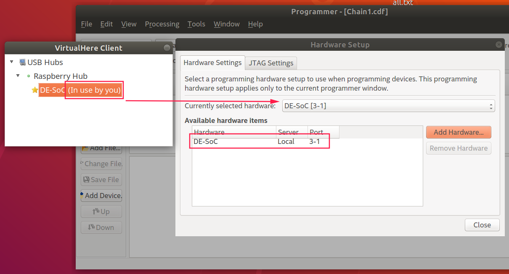
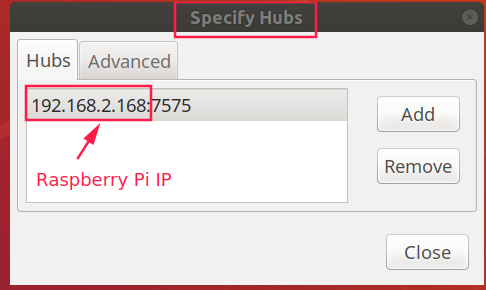

# VirtualHere Remote USB
Connect the DE10_nano USB Serial and USB Blaster II to Raspberry Pi.Power ON this System and click `Use The Device` on VirtualHere client.Then you can get these USB devices through Ethernet. 



## Install VirtualHere Server On Raspberry Pi
```
	wget https://www.virtualhere.com/sites/default/files/usbserver/vhusbdarm
	wget http://www.virtualhere.com/sites/default/files/usbserver/scripts/vhusbdpin
	sudo chmod a+x vhusbdarm
	sudo chmod a+x vhusbdpin 
	sudo mv vhusbdarm /usr/sbin/
	sudo mv vhusbdpin /etc/init.d
	sudo update-rc.d vhusbdpin defaults
	sudo reboot 
```
## Config VirtualHere Client On PC

```
	wget https://virtualhere.com/sites/default/files/usbclient/vhuit64
	sudo chmod a+x vhuit64
	sudo ./vhuit64
```
set the Raspberry Pi IP as serverip

